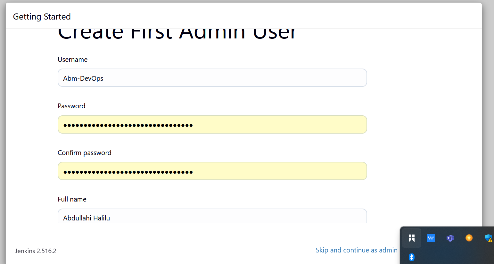

# Introduction_To_Jenkins 

# Introduction To CI/CD?

CI/CD stands for Continuous Integration (CI) and Continuous Delivery/Deployment (CD).
It’s a set of modern software development practices that help teams deliver code changes faster, safer, and more reliably.

## Continuous Integration (CI)
- Definition: A practice where developers frequently merge their code into a shared repository (e.g., GitHub, GitLab).

- Goal: Detect errors early by automatically building and testing every code change.

Key Steps in CI:
1. Developer pushes code to version control.

2. Automated build runs (compilation, linting, packaging).

3. Automated tests run (unit tests, integration tests).

4. Feedback is given quickly (pass/fail reports).

CI ensures that software is always in a working state.

## Continuous Delivery (CD)
- Definition: An extension of CI where code is automatically prepared for release to production.

- Goal: Ensure that software can be deployed at any time, safely and on demand.

Key Steps in CD:
1. After CI, artifacts (build outputs) are stored.

2. Automated deployment to a staging/test environment.

3. Automated tests run (UI tests, performance tests, security tests).

4. Code is kept “production-ready.”

 CD means deployments are manual but easy and safe.

 # What is Jenkins?
Jenkins is an open-source automation server used to automate building, testing, and deploying software. It’s one of the most popular tools for implementing Continuous Integration (CI) and Continuous Delivery/Deployment (CD).

It helps developers integrate code into a shared repository frequently and enables automated builds and tests, improving software quality and reducing integration issues.

# Getiing Started Wth Jenkins
Now thta we have an idea of jenkins is , lets dive into installing jenkins

1. update package repositories : "sudo apt update "

.

2. install JDK: "sudo apt install default-jdk-headless"

.

3. Install Jankins:
- wget -q -O - https://pkg.jenkins.io/debian-stable/jenkins.io.key | sudo apt-key add -

.

- sudo sh -c 'echo deb https://pkg.jenkins.io/debian-stable binary/ > /etc/apt/sources.list.d/jenkins.list'

- sudo apt update

- sudo apt install jenkins -y

.

The command installs Jenkins. It involves importing the Jenkins GPG key for package verification, adding the Jenkins repository to the system's sources, updating package lists, and finally, installing Jenkins through the package manager (apt-get).

# Check if jenkins has been installed, and it is up and running

1. sudo systemctl status jenkins

.

On our Jenkins instance, create new inbound rules for port 8080 in security group

By default, jenkins listens on port 8080, we need create an inbound rule for this in the security group of our jenkins instance

# Set up Jenkins On The Web Console

i. Input your Jenkins Instance ip address on your web browser i.e. http://public_ip_address:8080

ii. On your Jenkins instance, check "/var/lib/jenkins/secrets/initialAdminPassword" to know your password.
New chat

.

.

iii. Install suggested plugins.

.

iv. Created a user account:

.

v. Log into jenkins console:

.
